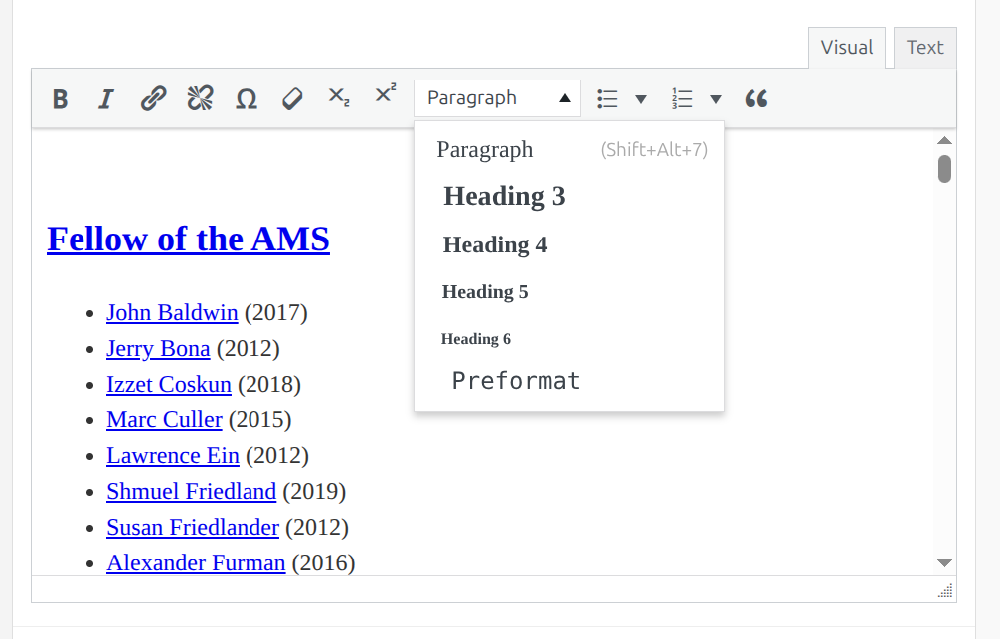

# Writing Accessible Web Content using Red

I would be happy to make an in-person or zoom presentation on this topic, and if this would be easier than going over this topic via a written document please let me know.

## Notes specific to Red

A personal pet-peeve I have with the design of Red is that it makes it appear as if you can write webpages while understanding *literally* nothing about HTML, which is, unfortunately, not true.  In order to avoid introducing accessibility issues (and to make the best use of the components available in Red) you actually have to know some basics about how HTML works and how you write accessible web pages.  You by no means have to be an expert, but you either have to know a Little bit about these topics or only make a very narrow scope of edits to pages.  When you are in doubt about how to best format information in Red so as to provide it in a way that is accessible, you can consult me, the Red team, or the BIC Digital Accessibility staff for assistance as necessary.  When in doubt, don't hesitate to ask for help!

Red was designed with some opinions about how it would be used to generate and display content.  It is sometimes tempting to try and "pound a round peg into a square hole" so as to do something with a component in Red that it was not really intended to do by the Red design team.  While this might seem to work, it's likely that this might result in accessibility issues because Red components are either accessible when used as intended, or can at least likely be modified by the Red design team to be more accessible when accessibility issues are reported to them.  The red team provides documentation on their components at:

https://red.uic.edu/features/all-components/

and when you are looking for an appropriate way to present information, you may consult that list to see what component best fits your intended use case.

## HTML tags

The way HTML structures content is by placing it between to tags.  For example ```<p>``` tags indicate a paragraph.  There are two tags one which "opens" an HTML element and another which "closes" that element.  (some tags, like the image tag are singular and do not need to be closed).  For example:

```
	<p>This is the first paragraph of text</p>
	<p>This will be a second paragraph of text</p>

```

The ```<p>``` is called a "semantic" tag because it has meaning, it means "this is a paragraph".  Some tags don't have any semantic meaning, they only put structure into the page, which might be used for visual formatting or some other purpose.  Examples of non-semantic tags include ```<div>```,  ```<span>```, and ```<br>```.  The ```<br>``` tag is a non-semantic line break.  It doesn't indicate a semantic reason for why there is a line break, it could be because you want to add space between paragraphs, add space between elements of list, or any myriad number of reasons.  The ```<br>``` tag is used like:

```
	This is a line of text<br>And this will appear on a second line of text
```

The Red visual editor provides an option select a subset of tags that you might want to enclose text:



## The gist of Web Accessibility

The fundamental idea of web accessibility is to make webpages as usable as possible for as diverse a group of people as possible.  For example: people with visual impairment may use a screen reader to read and navigate the contents of a page, some people may have a physical impairment that limits their ability to use a mouse and would like to navigate using the keyboard only, someone with dyslexia may have more trouble reading text in ALL CAPS than text written in normal case.  These are only a few examples of the use cases that we try to accommodate via accessible design.

As a general principle, we make design more accessible by writing HTML which is structured semantically instead of just visually.  For examples, if text is being broken up into paragraphs, it's better to use the ```<p>``` tag to indicate this instead of just sticking one or more ```<br>``` tags between the two paragraphs.


good:
```
	<p>This is the first paragraph of text</p>
	<p>This will be a second paragraph of text</p>

```
bad:
```
	This is the first paragraph of text<br><br>
	This looks like a second paragraph of text, but we can only tell by looking at the page visually.

```

Why is the first example more accessible than the first?  The reason is that since the ```<p>``` indicates "these are different paragraphs" and software can then do something with that information.  For example, a visually impaired user may navigate this page using a screen reader that has keyboard shortcuts to skip between paragraphs.  That screen reader may have different short cuts to skip between lines of text.  Furthermore, the screen reader might pause, as a human reader generally would, between different paragraphs of text, but might not pause or pause differently at a line break.  The more semantic information is available to a screen reader or other piece of assistive software, the better that software can present the webpage so as to be easily understandable and navigable by a visitor relying on assistive software.


## Well-structured pages vs. visual Formatting

HTML has tags can be used to organize content into sub-dived sections, often referred to as "headers" since they are written like ```<h1>, <h2>, <h3>```, ... which make pages easier to naviagte using screen readers or other programatic tools;  They also are generally appropriate for seperating out the sections and subsections of page visually.  Here is an example of how to use headers to structure a page:

```
	<h1>This is the highest level and in Red sites is set automatically to the page title</h1>

	This heading should be unique, it should be descriptive of the page's content taken as a whole

	<h2>This the first level of sub-division</h2>

	In red sites, this is the component title.  You may choose to hide this, but it will be used by screen readers to navigate the page and, as such, should still be descriptive of whatever content is contained in that component.  You should almost never manually insert an <h2> into your documents because this likely will not be accomplishing the goal of having the component collect related content into a sub-section of a page.

	<h3>This is the third level of sub-division</h3>

	In a given Red component this is the broadest sub-category that you will usually want to insert.

	<h4>This is the fourth level of sub-division</h4>

	You can uses these to divide an <h3> into sub-sections within a red-component's content.
```

For the best accessibility (largely because it enables the easiest page navigation via screen-readers, though it may be useful in other context as well) you want your page to always:

1. Include exactly one ```<h1>``` which summarizes the page content as a whole

2. Avoid skipping header levels, e.g. don't put an ```<h3>``` below an ```<h1>``` without an ```<h2>``` in-between.

3. Don't put content in a lower header level unless it is really a sub-section of the that content.

Good:
```
	  <h1>Page Title </h1>
	  <h2>First Section Title</h2>
	  <h3>Sub-section Title</h3>
```	  
Bad:
```
  	  <h1>Page Title </h1>
	  <h2>First Section Title</h2>
	  <h3>Second Section Title</h3>
```
4. Conversely, don't put sub-section content in a higher header level to provide visual emphasis to an important sub-section, find some other way to emphasize that content like ```<strong>``` or ```<em>```.

Good:
```
	  <h1>Page Title </h1>
	  <h2>First Section Title</h2>
	  <h3>Normal Sub-section Title</h3>
	  <h3><strong>Important Sub-section Title</strong></h3>
```
Bad:
```
  	  <h1>Page Title </h1>
	  <h2>First Section Title</h2>
	  <h3>Normal Sub-section Title</h3>
	  <h2>Important Sub-section Title</h2>
```
Note that in the Red "Visual" editor for Text Block components the various header levels are select-able as a drop down down.  Text that is not a header should use the "Paragraph" option.


4. Don't use emphasis tags like ```<strong>``` or formatting tags like ```<b>``` to create section divisions that work for visual users but not user's relying on software to navigate the page structure (e.g. screen readers)

Good:
```
	  <h1>Page Title </h1>
	  <h2>First Section Title</h2>
	  <h3>Sub-section Title</h3>
```
Bad:
```
  	  <strong>PAGE TITLE</strong>
	  <strong>First Section Title</strong>
	  <em>Sub-section Title</em>
```
** I had to fix this kind of thing a lot on mscs.uic.edu**

5. Header's should accurately describe the content of the page content which they sub-divide.

Good (well not great, but the header part is good and the content is probably OK):
```
	  <h1>Dumb Jokes</h1>
	  <n2>Chicken Related</h2>
	  <h3>Why didn't the chicken cross the road?</h3>

	  The other side wasn't accessible
```
Bad:
```
	  <h1>Dumb Jokes</h1>
	  <h2>Chicken Related<h2>
	  <h3>Why didn't the chicken cross the road?</h3>
	  The other side wasn't accessible
	  <h3>But aren't you glad I didn't say "banana"?</h3>
	  This has nothing to do with chickens
```

Note: When you use the "page intro" section of a Red page, you need to set a page title for that section.  You can hide that title, but it still needs to be descriptive of that section of the page.   Often a title like "Intro" or "About ..." may be appropriate.  Keep in mind that the screen reader will likely read out the whole title, so avoid being needlessly verbose
	  
** This kind of thing was something I had to fix a lot on mscs.uic.edu, especially when it was a hidden title **


## Images, Alt Text, and Captions
	  
When somebody uses a screen reader to read a web page, the screen reader will read out the alt text for an image.  As such the alt text should substitute for that image as best as possible.  Alt text should not include words like "image of" or "picture of" because the screen reader will itself indicate that it is reading image alt-text.  If an image is purely decorative, alt text should be blank; however since Red does not allow this, you may use alt="decorative" in this case.  Eventually Red should support a checkbox that indicates decorative images so they can properly be presented with blank alt text.

In cases where an image is not purely decorative, the alt text should provide as good of a description that substitutes for the visual of availability of the image as possible.

The "caption" part of an image is displayed along with the image and can be used to provide extra contextual info about an image that may not be obvious to a web site viewer.  The caption is also available to a screen reader user and it is almost never appropriate to have the alt text and caption contain exactly the same text.  For an image with both an alt text and a caption the alt text should provide information that would be understood by viewing the image while the caption provides information that is not obvious even to someone who can view the image.

Let's say for example we want to provide a caption or alt text for:


Good:
```
	<im src="lev.avif" alt="A professor gestures at a chalkboard" caption="Professor Lev Reyzin">
```
Bad:
```
	<im src="lev.avif" alt="Professor Lev Reyzin" caption="Professor Lev Reyzin gestures at a chalkboard">
```
Worse:
```
	<im src="lev.avif" alt="Image of Professor Lev Reyzin" caption="Image of Professor Lev Reyzin">
```

** I had to fix a lot of alt text in Red, many times alt text was simply totally inappropriate however another problem was occasionally that alt text was appropriate for an image that had been used in the past but had since been updated to a different image and was, therefore, no longer appropriate **


## Links

There a some important things to keep in mind when setting link text to produce accessible content.

1. Links should describe there target destination without additional context being required

A screen reader may read all links on a page when being used to navigate and it will read those links without any context.  To be useful, a link's text must describe the content to which it is link.

Good:
```
	Please consult <a href="https://www.mozillafoundation.org/en/docs/design/websites/accessibility-guidelines/">Mozilla's web accessibility guidelines</a> for more info web accessibility.
```
Bad:
```
	Please consult Mozilla's web accessibility guidelines <a href="https://www.mozillafoundation.org/en/docs/design/websites/accessibility-guidelines/">website</a> for more info web accessibility.
```
Worse:
```
	Please consult <a href="https://www.mozillafoundation.org/en/docs/design/websites/accessibility-guidelines/">this</a> page for more info web accessibility.
```
(in this case neither visual readers of the page nor screen reader user's know where that link points to without following it)

2. Screen readers will likely read URL's out letter-by-letter, this may be OK for links to the top-level domain of site but should not be used for link's to sub-pages or when there's a better textual description.

Good:
```
    <a href="https://mscs.uic.edu/about/people/faculty-awards/">MSCS department awards</a>
```
OK, not great:
```
    <a href="https://mscs.uic.edu/">https://mscs.uic.edu</a>
```
Bad:
```
    <a href="https://mscs.uic.edu/about/people/faculty-awards/">https://mscs.uic.edu/about/people/faculty-awards/</a>
```
Note:

my.uic.edu is now generally linked to as myUIC, using my.UIC.edu as link text is probably OK, but myUIC is better.


## Visual Emphasis Only is Bad, ALL CAPS IS EVEN WORSE

If a page element is emphasized only in a visual way, a screen reader cannot possibly hope to indicate that this element is significant.  Visual emphasis by color only may not stand out to colorblind page users (as well as not being of any use to the blind).  It is OK to use, e.g. color to emphasize a page element, but that cannot be the only way to emphasize that page element.  Using semantic emphasis tags like ```<strong>``` and ```<em>``` is considered acceptable (though it's not optimal because since these tags are used so commonly many screen readers will not indicate the presence of these tags in their default configuration), there is no simple, obviously superior alternative so it is acceptable to use these tags to emphasize text.

OK:
```

	This is emphasized <strong style="color: red;">semantically and visually</strong>.
```
Bad:
```
    This is emphasized <div style="color: red;">visually only</div>.
```
ALL CAPS is problematic not just because it is visual emphasis of text, but because ALL CAPS text is harder to read for dyslexics and may cause screen readers to read the text letter-by-letter.  All caps is appropriate, of course, for abbreviates like MSCS and VIC that *should* by read letter-by-letter and is acceptable for abbreviations like NASA which are not typically read letter-by-letter but are none-the-less abbreviations.

Worse:
```
    This is emphasized USING ALL CAPS.
```


## Watch out for copy and paste problems

When your source document looks OK it's tempting to just copy and paste that content into Red to use as is.  However, that is not always going to be a safe thing to do.  Here's some things to watch out for:

1. MS Outlook has this thing it does where it automatically replaces links with a proxy link in emails.  Microsoft can then do some kind of check of the target page before they redirect you to the content, which might catch some kinds of malware and phishing.  However, this can introduce latency when a user clicks a safe-link since Microsoft may do some kind of content check before the direction.  Worse, if the email that contained the safe-link has been deleted, the safe-link proxy link may also cease to exist, resulting in a broken link.  Another problem with these "Safelinks" is that when you look at such a link outside of Microsoft Outlook (either the desktop or web version) you cannot easily tell what URL that link is pointing to without following it (or pasting it into a safelinks decoder tool).  Thus, when copying and pasting hyperlinks out of emails, you will want to replace the link target with the actual destination.  You can do this by first following the safelinks link, then copying and pasting that URL out of the web-browser into the page content you are writing.

2. Microsoft Office and some other software often generates characters that may look like another character that's safe to use on webpages, like a quotation mark, or space, but is in fact some other goofy kind of character that won't work.

3. In the glory days of desktop computing, when you copied text from something, you were always copying plain-text, which was often safe to paste into a web-site as long as it didn't contain those funny Microsoft-only directed quotation marks.  Now however, you might actually be copying some kind-of formatted text, like HTML or Rich Text.  Pasting this into the visual editor in Red (or other applications) may produce unexpected results.  Windows, MacOS, and typical Linux Desktops generally offer an option to "paste as plaintext", which will paste only the text characters and not any formatting data.  This may sometimes be useful when copying and pasting content into Red's visual editor.


